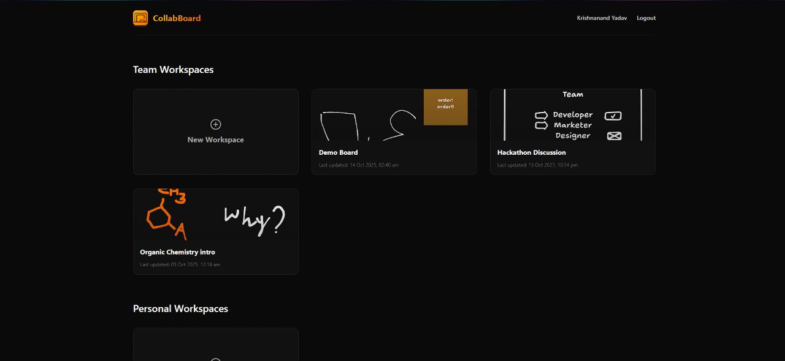
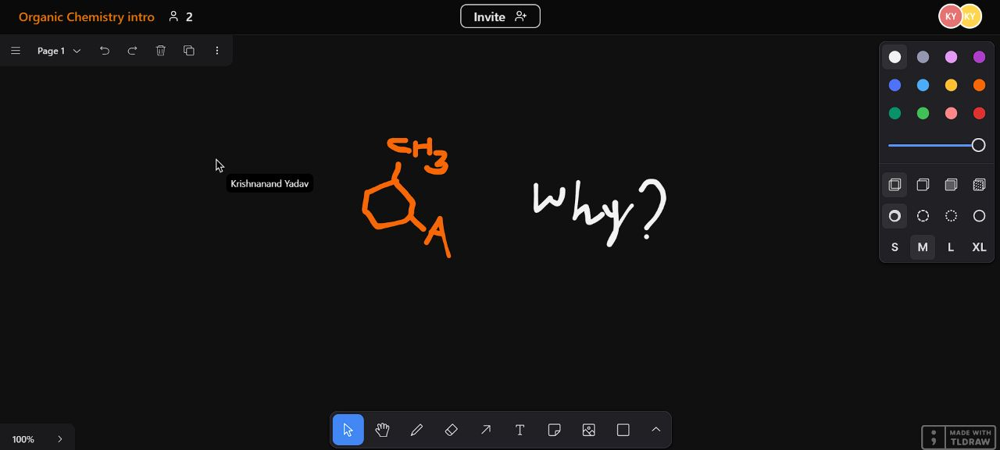

# CollabBoard

**CollabBoard** is a real-time collaborative whiteboard web application built with React, Supabase, tldraw, and Liveblocks. It allows multiple users to draw, add sticky notes, and collaborate simultaneously.

This project demonstrates modern frontend architecture, real-time state management, and product-level UI/UX design.

---

## Live Link

You can check out CollabBoard [here](https://collab-board-app-one.vercel.app/).

### Screenshots





### Video

[](https://youtu.be/TFns7vs7eS4)

---

## 🌟 Features

- **Real-time collaboration** using _Liveblocks_
- **Canvas & drawing** powered by _tldraw_
- **Role Based Access Control (RBAC)**: Owner, Editor, Viewer
- **Authentication & storage** via _Supabase_
- Seamless multi-client synchronization
- Responsive UI for desktop and tablet screens

---

## 🛠️ Tech Stack

- **Frontend**: [React](https://react.dev/), [TypeScript](https://www.typescriptlang.org/)
- **Realtime**: [Liveblocks](https://liveblocks.io/)
- **Authentication & Storage**: [Supabase](https://supabase.com/)
- **Canvas**: [tldraw](https://tldraw.dev/)
- **Styling**: [Tailwind CSS](https://tailwindcss.com/)

---

## 💻 Running the Project Locally

These instructions will help you set up a copy of the project on your local machine.

### IMPORTANT

CollabBoard requires Supabase and Liveblocks to run. Setting up a local development environment involves configuring authentication, storage, database schema, RLS policies, RPCs, and edge functions. Kindly contact me to get the exact setup.

### Installing & Usage

1. Clone the repository to your local machine:

   ```bash
   git clone https://github.com/Krishnanand2517/collab-board.git
   ```

1. Navigate to the project directory & install the project dependencies:

   ```bash
   cd collab-board/client
   npm install
   ```

1. Copy the environment variables to a new file `.env.local`:

   ```bash
   cp .env.sample .env.local
   ```

   Obtain the values and API keys for the variables from your Supabase project (create a new Supabase project for collab-board, if you haven't done so already).

1. Once you have installed the project and its dependencies, you can run the development server:

   ```bash
   npm run dev
   ```

   This will start the development server on port 5173, and you can access the project in your web browser at http://localhost:5173/.

---

## 🤝 Contributions

CollabBoard is a complex project with backend dependencies (Supabase + Liveblocks). Contributions are welcome, but please note:

- Setup requires a configured Supabase project, RLS policies, RPCs, and edge functions.
- If you’re contributing, contact me to get figure out the exact setup.

---

## 🚀 Next Steps

- Share **images** on boards
- Improve UI/UX **responsiveness** on mobile devices
- Add **chats** & **annotation** system
- **AI & Clustering** features

**Happy coding!**
